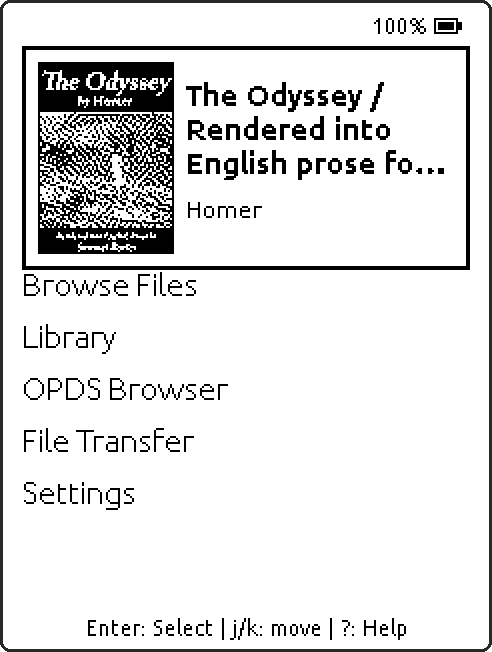
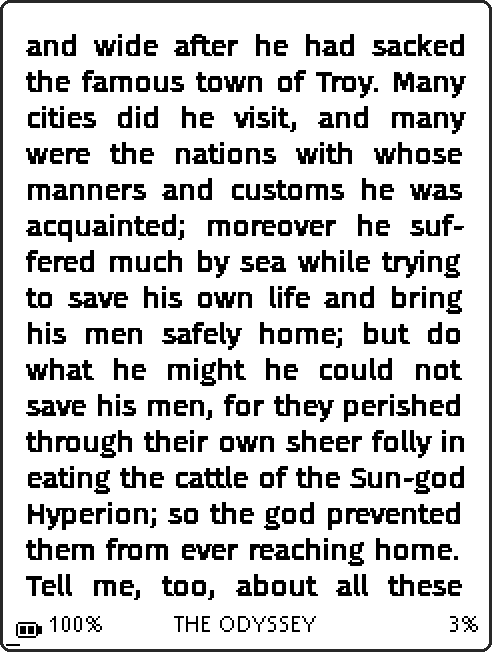
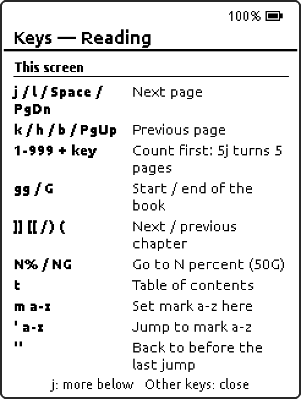
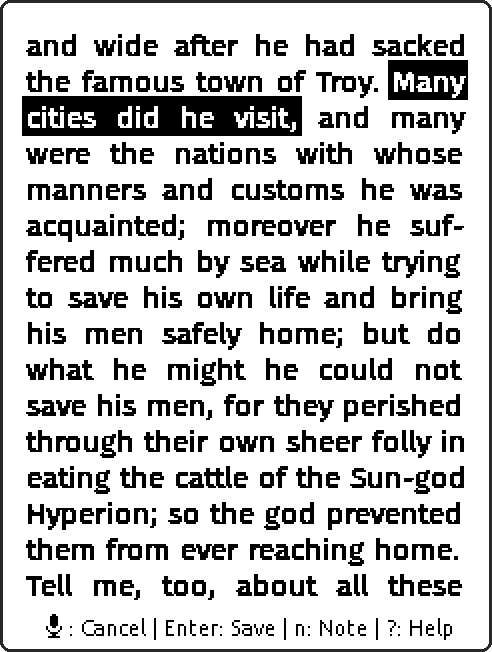
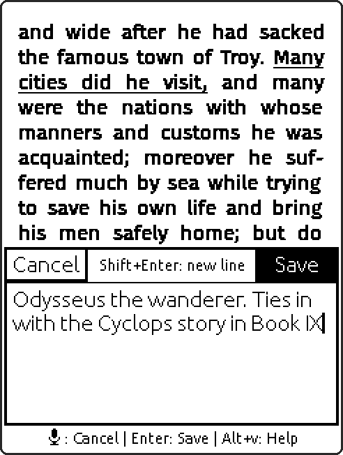
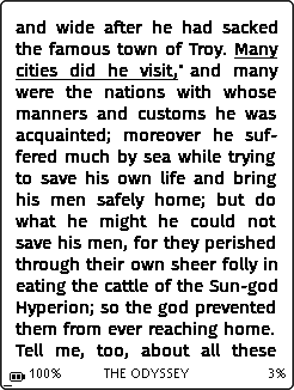
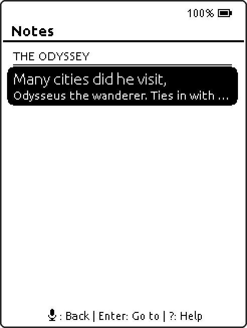
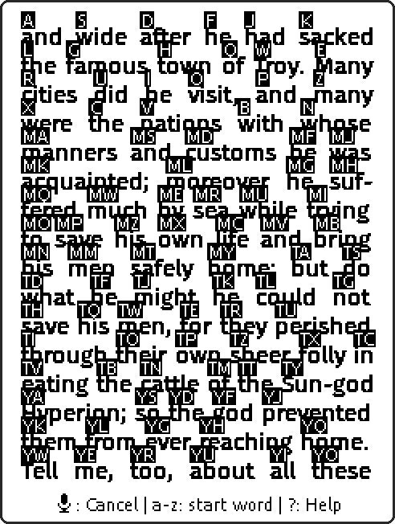
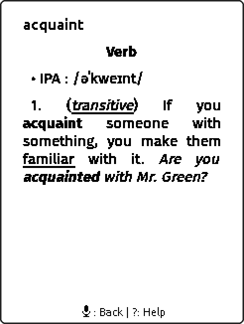

# DeckPoint

A keyboard-first e-reader firmware for the **LilyGo T-Deck Pro**: a 3.1" e-ink screen, a real
thumb keyboard, and a reader that behaves a little like `less` with better typography.

DeckPoint is a fork of [CrossPoint Reader](https://github.com/crosspoint-reader/crosspoint-reader)
and builds on the ideas of **CrossInk** (see [CREDITS.md](CREDITS.md), which is a thank-you note
first and a license file second). It still builds for the Xteink X4 family too, because we did
not want to break the thing we borrowed.

> Status: works on the author's device and gets daily use, but it is young. Expect rough edges,
> and please keep a backup of your SD card. No promises, some enthusiasm.

## Screenshots

Straight from the device (The Odyssey, Samuel Butler's public-domain translation).

<table>
  <tr>
    <td align="center" width="33%"><br><sub>Home: your current book, one keypress away</sub></td>
    <td align="center" width="33%"><br><sub>Reading: justified, hyphenated, 240x320</sub></td>
    <td align="center" width="33%"><br><sub><code>?</code> lists the keys that work on every screen</sub></td>
  </tr>
  <tr>
    <td align="center" width="33%"><br><sub><code>v</code> + word labels: select a passage</sub></td>
    <td align="center" width="33%"><br><sub>Notes in a bottom sheet, page still visible</sub></td>
    <td align="center" width="33%"><br><sub>Saved: underlined, with a note marker</sub></td>
  </tr>
  <tr>
    <td align="center" width="33%"><br><sub><code>:notes</code>: every highlight in the book</sub></td>
    <td align="center" width="33%"><br><sub><code>d</code> labels every word for lookup</sub></td>
    <td align="center" width="33%"><br><sub>StarDict lookup, inflections included</sub></td>
  </tr>
</table>

## What it does

**Reading, with the keyboard**
- Vim-style reader keys: `j`/`k`/`h`/`l`, Space, counts (`5j`), `gg`/`G`, `]]`/`[[`, marks
  (`m a`, `' a`), `/` search with `n`/`N`.
- A `:` command line (`:toc`, `:notes`, `:export`, `:sync`, `:goto`, `:dict`, `:font`, `:night`,
  `:sleep`, ...), with completion and recall.
- Hint-mode dictionary lookup: press `d`, every word gets a letter label, type the label.
  (StarDict dictionaries on the SD card.)
- A `?` help screen on every screen that lists the keys that work there, plus an optional key
  legend along the bottom (Settings > Display > Key Legend).

**Highlights and notes**
- Select with `v` plus word labels, or long-press on the touchscreen. Underlined on the page.
- Notes are written in a bottom-sheet editor, so the page stays visible above it.
- Export as Markdown (one file per book, Obsidian-friendly) and as a KOReader-style
  `My Clippings.txt`.
- **KOReader-compatible annotation sync** over WebDAV (developed against Nextcloud): highlights
  and notes travel in AnnotationSync.koplugin's format, anchored with KOReader-exact XPointers,
  so they land on the same words in KOReader.
- **KOSync** reading-progress sync, as in CrossPoint.

**Touch** (T-Deck Pro): tap zones, swipes, long-press a word for lookup, tappable lists. Keys
win over touch when a keyboard mode is active, and touch can be switched off in
Settings > Controls.

**Everything else from CrossPoint** that still makes sense on a small screen: EPUB rendering,
custom SD fonts, hyphenation, themes (Classic, Lyra, Lyra Extended, RoundedRaff), night mode,
OPDS browsing, OTA, many UI languages. Metrics and fonts are tuned for 240x320.

**Moving files around**
- **File Transfer**: web UI over Wi-Fi (hotspot or your network). While it is open, the device
  can also be mounted as a **WebDAV drive** from your computer.
- **USB Drive**: the SD card appears as mass storage. Eject it on your computer to get the
  reader back. (Mic/back will tell you so if you press it too early.)

## Hardware notes

- LilyGo T-Deck Pro: ESP32-S3, 16 MB flash, 8 MB PSRAM, UC8253 e-ink panel, TCA8418 keyboard,
  CST3530 touch, SD card.
- **Side buttons:** the upper one is sleep / wake; the lower one is a reset button (it also
  "wakes" the device, by rebooting it).
- The key printed with a microphone is **Esc / Back** as far as DeckPoint is concerned.
- Modifiers: Shift, Sym (digits and symbols) and Alt. Tap one for the next key only; an
  on-screen badge shows what is active.

## Keyboard cheat sheet

`?` opens help for the current screen (`Alt+v` too, where `?` would type).

| Where | Keys | Does |
| --- | --- | --- |
| Lists | `j` / `k`, `Enter`, mic | move, open, back |
| Tabbed lists | `h` / `l` | switch tab |
| Lists | hold `j` / `k` | page jump |
| Library, file browser | hold `Enter` | actions menu |
| Reader | `j` `l` Space PgDn / `k` `h` `b` PgUp | next / previous page |
| Reader | `5j` | counts work: turns 5 pages |
| Reader | `gg` / `G` | book start / end |
| Reader | `]]` `[[` or `)` `(` | next / previous chapter |
| Reader | `N%` / `NG` | go to percent |
| Reader | `t` | table of contents |
| Reader | `m a-z` / `' a-z` / `''` | set mark / jump to mark / jump back |
| Reader | `B` | toggle bookmark |
| Reader | `Enter` | reader menu |
| Reader | `:` | command line |
| Reader | `d` | label every word, type a label to look it up |
| Reader | `D` | look up a typed word |
| Reader | `v` | highlight: pick start and end by label |
| Reader | `/`, then `n` / `N` | search the book, next / previous match |
| Reader | mic | drop half-typed keys, otherwise go home |
| Highlight mode | `Enter` / `n` / Backspace / mic | save (or one word) / add note / undo / cancel |
| Note sheet | `Enter` / `Shift+Enter` / mic | save / new line / cancel |
| Text entry | `Alt+h` `Alt+l` / `Alt+Backspace` | move cursor / clear |
| Notes list (`:notes`) | `Enter` / `e` / `x` `x` | go to / edit note / delete |

Copied from the in-firmware help tables (`src/deckpoint/KeyHelpTables.cpp`). If the firmware and
this page disagree, the firmware wins and this page has a typo.

## Installing

Grab `deckpoint-tdeckpro-full.bin` from the
[latest release](https://github.com/jdkruzr/DeckPoint/releases/latest) and write it at `0x0`,
either in the browser with [esptool-js](https://espressif.github.io/esptool-js/) or with
`esptool --chip esp32s3 write-flash 0x0 deckpoint-tdeckpro-full.bin`. Step by step, plus
first-time setup (dictionary, Wi-Fi, sync): [docs/deckpoint/INSTALL.md](docs/deckpoint/INSTALL.md).

## Building and flashing

You need [PlatformIO](https://platformio.org/).

```bash
pio run -e tdeckpro                                      # build for the T-Deck Pro
scripts/deckpoint_flash.sh /tmp/deckpoint /dev/ttyACM0   # build + flash (port may differ)
pio run -e x4pro                                         # the stock Xteink build still works
```

`scripts/deckpoint_flash.sh <dir> <port>` builds, pauses the dev serial bridge
(`scripts/deckpoint_serial.py`) if one is running, and flashes. Run
`./bin/clang-format-fix -g` before committing.

## Docs

- [docs/deckpoint/PROGRESS.md](docs/deckpoint/PROGRESS.md): what is done, the dev loop, conventions.
- [docs/deckpoint/NEXT_STEPS.md](docs/deckpoint/NEXT_STEPS.md): what is next, and why things are the way they are.
- [docs/crosspoint-README.md](docs/crosspoint-README.md): the upstream CrossPoint README, kept
  for the general feature list, install notes and development quick start.
- [USER_GUIDE.md](USER_GUIDE.md) and the rest of [docs/](docs/): CrossPoint's guides. Mostly
  still true, but they do not know about the keyboard.

## Credits and license

DeckPoint exists because [CrossPoint Reader](https://github.com/crosspoint-reader/crosspoint-reader)
and CrossInk did the hard parts first. Details, and everyone else we owe thanks to, are in
[CREDITS.md](CREDITS.md). DeckPoint is MIT licensed, like CrossPoint (see [LICENSE](LICENSE)).
